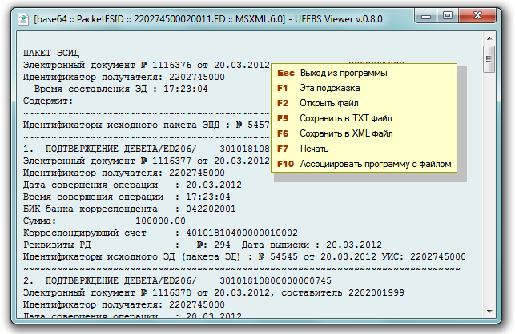

#  UFEBS Viewer

Просмотр файлов формата УФЭБС.

Данное HTA-приложение предназначено для просмотра файлов формата УФЭБС.  
Для ХSLT преобразований использован переработанный файл от 
[AstraKBR](http://astrasoft.su/AstraKBR.htm).

## Основные возможности программы

* Осуществляет просмотр как кодированных (в base64), так и уже декодированных 
в xml файлов.
* Помимо просмотра, возможна печать содержимого и сохранение его в текстовом 
или xml виде.
* Возможна регистрация пункта "UFEBS Viewer" в контекстном меню файлов 
заданного типа, а так же установка ярлыка в контекстном меню "Отправить", 
что облегчает ее использование.
* Возможна работа в автоматическом режиме. В командной строке, кроме имени 
открываемого файла, можно использовать следующие ключи:

  `/Print` | автоматически распечатать документ на принтере по-умолчанию
  `/SaveText c:\folder` | сохранить документ в текстовый файл в каталог `c:\folder`
  `/SaveXML c:\folder` | сохранить документ в XML файл в каталог `c:\folder`
  `/Close` | закрыть окно программы через 10 сек
  `/Help` или `/?` | вызов справки по ключам командной строки

## Замечания к использованию

* Распаковать дистрибутивный `zip` из 
[Releases](https://github.com/diev/UFEBS-Viewer-hta/releases) в отдельную 
папку.
* Программа из соображений защиты IE работает только с локального диска!
* До первого запуска программы внимательно изучите и отредактируйте 
`UFEBS_Viewer.ini`.

Смотрите также проект [SVK Transport](/SVK-Transport-hta) 
для обмена посылками с системой СВК Банка России.

## История версий

Программа импортирована на GitHub с версии 1.4.2 с ее страницы на 
[Bitbucket](https://bitbucket.org/html-applications/ufebs-viewer) 
первоначального автора **mozers**.

## Лицензионное соглашение

Приложение распространяется по лицензии 
[Apache 2.0](http://www.apache.org/licenses/LICENSE-2.0 "Текст лицензии").  
(Вы можете использовать его совершенно свободно без всяких ограничений.)

Данные для обратной связи находятся в коде заголовка HTA приложения.
